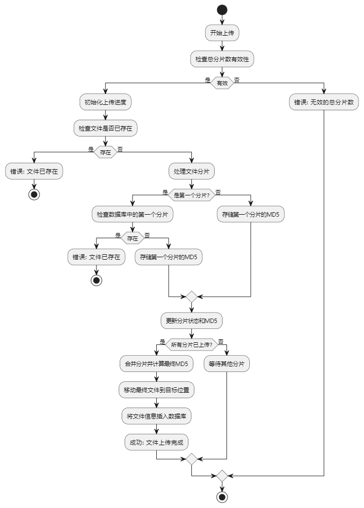
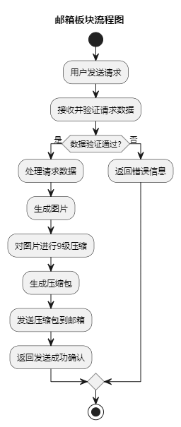

# 项目管理系统测试版
简体中文 | [English](https://github.com/SuLea-IT/PM-System-Beta/blob/main/README.md)

> 这个项目是一个基于 `Node` / `Python` 的后端应用，主要用于部分数据分析。

### 目录结构

```bash
PM-System-Beta/
├── PM-System-Beta.iml
├── README.md
├── README.zh-CN.md
├── app.js
├── bin/
│   └── www
├── package-lock.json
├── package.json
├── public/
│   └── stylesheets/
├── routes/
│   ├── index.js
│   └── users.js
├── sql/
│   └── PM-System.sql
└── views/
    ├── error.pug
    ├── index.pug
    └── layout.pug


```
### 部署

1. 克隆项目代码

   ```cmd
    git clone https://github.com/SuLea-IT/PM-System-Beta.git
   ```

2. 进入项目目录

   ```cmd
   cd PM-System-Beta
   ```

3. 安装依赖

   ```
   npm install
   ```

4. 运行项目

   ```cmd
   node bin/www
   ```
### 功能流程图：
- 大文件分片上传(增量计算)：



- 邮箱发送功能：



