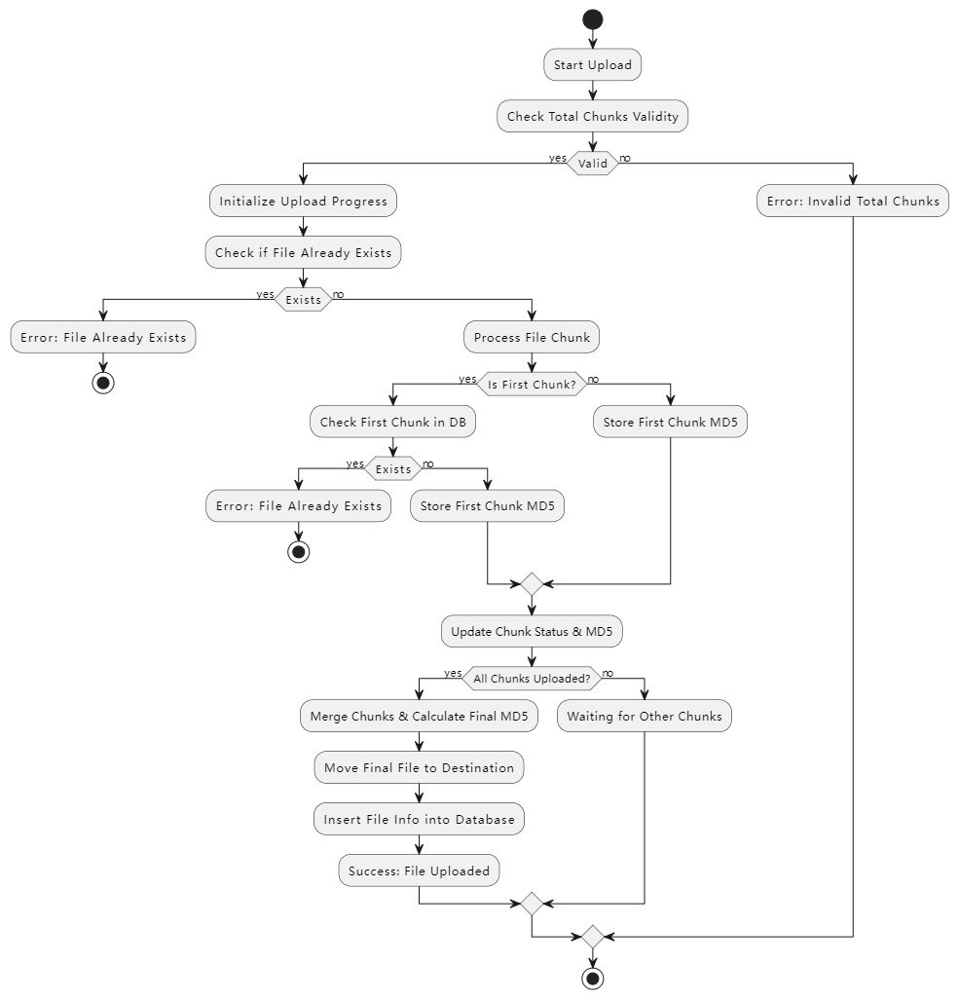
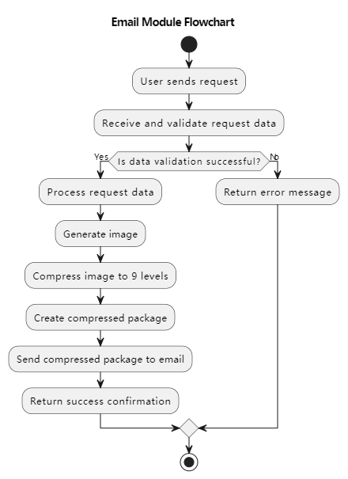

# PM-System-Beta
[简体中文](https://github.com/SuLea-IT/PM-System-Beta/blob/main/README.zh-CN.md) | English

> This project is a backend application based on `Node` / `Python` , primarily used for certain data analysis.

### Directory Structure

```bash
PM-System-Beta/
├── PM-System-Beta.iml
├── README.md
├── README.zh-CN.md
├── app.js
├── bin/
│   └── www
├── package-lock.json
├── package.json
├── public/
│   └── stylesheets/
├── routes/
│   ├── index.js
│   └── users.js
├── sql/
│   └── PM-System.sql
└── views/
    ├── error.pug
    ├── index.pug
    └── layout.pug

```
### Backend Deployment

1. Clone the project repository

   ```cmd
    git clone https://github.com/SuLea-IT/PM-System-Beta.git
   ```

2. Navigate to the project directory

   ```cmd
   cd PM-System-Beta
   ```

3. Install dependencies

   ```
   npm install
   ```

4. Run the project

   ```cmd
   node bin/www
   ```
### Functional Flowchart:
- Large File Chunk Upload (Incremental Calculation):



- Email sending function：


